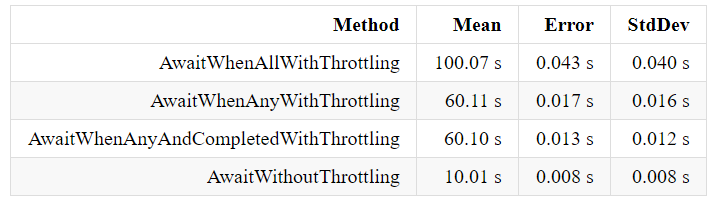

# dotnet-async-throttling

The purpose of this benchmark is to find the fastest way to perform multiple tasks in parallel using throttling.

## Scenarios with Throttling

- AwaitWhenAllWithThrottling() 
    - performing *N* tasks at a time 
    - awaiting all *N* tasks
    - removing them from the task list at each throttle cicle

- AwaitWhenAnyWithThrottling() 
    - performing *N* tasks at a time and 
    - awaiting any task from *N*
    - removing only one completed task at each throttle cicle

- AwaitWhenAnyAndCompletedWithThrottling() 
    - performing *N* tasks at a time
    - awaiting any task from *N*
    - removing all completed tasks at each throttle cicle

**Parameters**

```
- Taks Counts = 100
    - with Timeout.Delay(1..10 in a row)
- Throttling = 10 tasks  
```

## Scenario without Throttling (for comparison only)

- AwaitWithoutThrottling 
    - performing all the tasks at the same time 
    - awaiting one task at a time

**Parameters**

```
- Taks Counts = 100
    - with Timeout.Delay(1..10 in a row)
```
## Results



*Benchmark using: https://github.com/dotnet/BenchmarkDotNet*